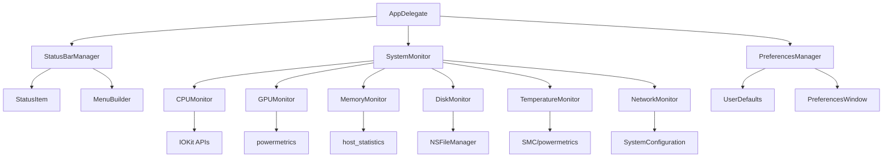
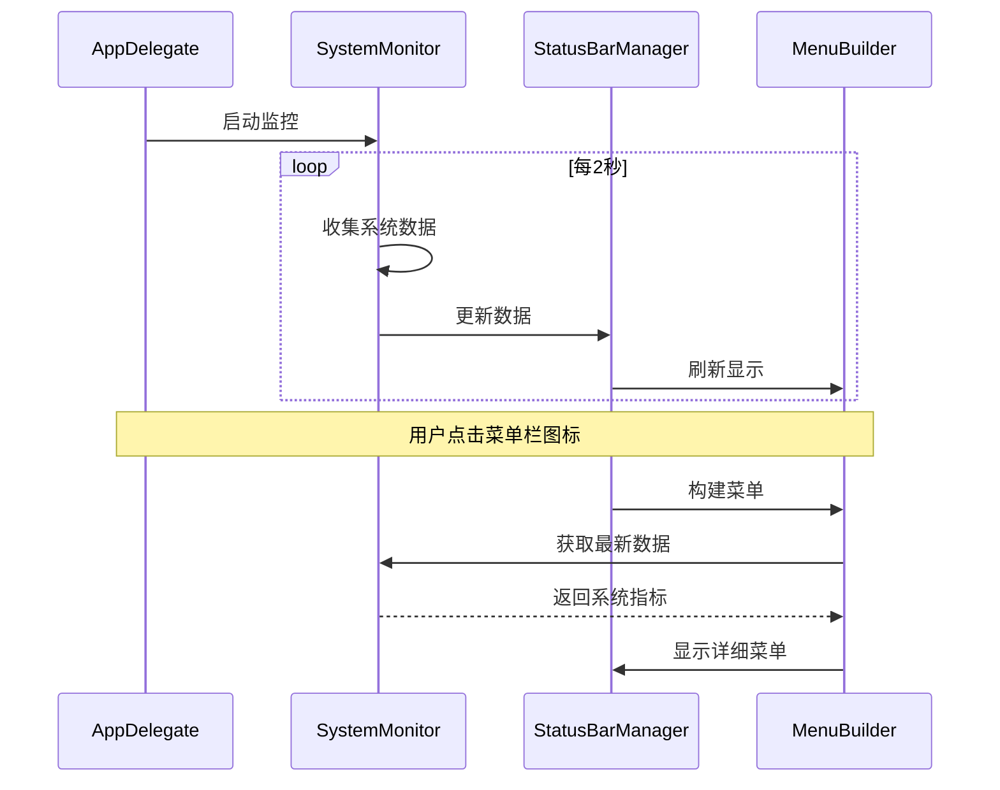

# 设计文档

## 概述

macOS系统监控应用是一个使用Swift和AppKit开发的菜单栏应用程序。该应用利用macOS的NSStatusItem API在菜单栏中显示系统性能信息，并通过IOKit框架、powermetrics命令行工具和系统API收集实时系统数据。

应用采用模块化架构，将数据收集、UI显示和用户设置分离，确保高性能和可维护性。

## 架构

### 整体架构



### 数据流



## 组件和接口

### 1. AppDelegate
主应用程序委托，负责应用生命周期管理。

```swift
class AppDelegate: NSObject, NSApplicationDelegate {
    var statusBarManager: StatusBarManager?
    var systemMonitor: SystemMonitor?
    var preferencesManager: PreferencesManager?
    
    func applicationDidFinishLaunching(_ notification: Notification)
    func applicationWillTerminate(_ notification: Notification)
}
```

### 2. StatusBarManager
管理菜单栏状态项和用户交互。

```swift
class StatusBarManager {
    private var statusItem: NSStatusItem?
    private var menuBuilder: MenuBuilder
    
    func setupStatusItem()
    func updateStatusDisplay(with data: SystemData)
    func showMenu()
    func hideMenu()
}
```

### 3. SystemMonitor
协调所有系统监控模块的数据收集。

```swift
class SystemMonitor {
    private var cpuMonitor: CPUMonitor
    private var gpuMonitor: GPUMonitor
    private var memoryMonitor: MemoryMonitor
    private var diskMonitor: DiskMonitor
    private var temperatureMonitor: TemperatureMonitor
    private var networkMonitor: NetworkMonitor
    
    func startMonitoring()
    func stopMonitoring()
    func getCurrentData() -> SystemData
}
```

### 4. 监控模块接口

```swift
protocol MonitorProtocol {
    associatedtype DataType
    func collect() -> DataType
    func isAvailable() -> Bool
}

class CPUMonitor: MonitorProtocol {
    func collect() -> CPUData
    private func getCPUUsage() -> Double
    private func getCPUFrequency() -> Double
}

class GPUMonitor: MonitorProtocol {
    func collect() -> GPUData
    private func getGPUUsage() -> Double
    private func getGPUMemory() -> (used: UInt64, total: UInt64)
}

class MemoryMonitor: MonitorProtocol {
    func collect() -> MemoryData
    private func getMemoryPressure() -> MemoryPressure
    private func getMemoryUsage() -> (used: UInt64, total: UInt64)
}

class TemperatureMonitor: MonitorProtocol {
    func collect() -> TemperatureData
    private func getCPUTemperature() -> Double?
    private func getGPUTemperature() -> Double?
}
```

### 5. PreferencesManager
管理用户设置和偏好。

```swift
class PreferencesManager {
    private var userDefaults: UserDefaults
    
    var updateInterval: TimeInterval { get set }
    var displayOptions: DisplayOptions { get set }
    var warningThresholds: WarningThresholds { get set }
    
    func showPreferencesWindow()
    func saveSettings()
    func loadSettings()
}
```

## 数据模型

### SystemData
```swift
struct SystemData {
    let cpu: CPUData
    let gpu: GPUData
    let memory: MemoryData
    let disk: [DiskData]
    let temperature: TemperatureData
    let network: NetworkData
    let timestamp: Date
}
```

### CPUData
```swift
struct CPUData {
    let usage: Double // 0.0 - 100.0
    let coreCount: Int
    let frequency: Double // GHz
    let processes: [ProcessInfo]
}
```

### GPUData
```swift
struct GPUData {
    let usage: Double // 0.0 - 100.0
    let memoryUsed: UInt64 // bytes
    let memoryTotal: UInt64 // bytes
    let name: String
}
```

### MemoryData
```swift
struct MemoryData {
    let used: UInt64 // bytes
    let total: UInt64 // bytes
    let pressure: MemoryPressure
    let swapUsed: UInt64 // bytes
}

enum MemoryPressure {
    case normal, warning, critical
}
```

### TemperatureData
```swift
struct TemperatureData {
    let cpuTemperature: Double? // Celsius
    let gpuTemperature: Double? // Celsius
    let fanSpeed: Int? // RPM
}
```

### NetworkData
```swift
struct NetworkData {
    let uploadSpeed: UInt64 // bytes/sec
    let downloadSpeed: UInt64 // bytes/sec
    let totalUploaded: UInt64 // bytes
    let totalDownloaded: UInt64 // bytes
}
```

### 配置数据模型
```swift
struct DisplayOptions {
    var showCPU: Bool
    var showGPU: Bool
    var showMemory: Bool
    var showDisk: Bool
    var showTemperature: Bool
    var showNetwork: Bool
    var menuBarFormat: MenuBarFormat
}

struct WarningThresholds {
    var cpuUsage: Double
    var memoryUsage: Double
    var temperature: Double
}

enum MenuBarFormat {
    case percentage, icon, both
}
```

## 技术实现细节

### 系统数据收集方法

1. **CPU监控**
   - 使用 `host_processor_info()` 获取CPU使用率
   - 通过 `sysctl` 获取CPU频率和核心数
   - 使用 `proc_listpids()` 获取进程信息

2. **GPU监控**
   - 使用 `powermetrics` 命令获取GPU使用率
   - 通过IOKit获取GPU内存信息
   - 支持Apple Silicon和Intel GPU

3. **内存监控**
   - 使用 `host_statistics()` 获取内存统计
   - 通过 `vm_stat` 获取虚拟内存信息
   - 计算内存压力状态

4. **温度监控**
   - 使用SMC (System Management Controller) API
   - 通过 `powermetrics -s smc` 获取温度数据
   - 支持Apple Silicon和Intel处理器

5. **网络监控**
   - 使用 `getifaddrs()` 获取网络接口统计
   - 计算实时上传/下载速度
   - 监控所有活动网络接口

6. **磁盘监控**
   - 使用 `NSFileManager` 获取磁盘空间
   - 通过 `statfs()` 获取文件系统信息
   - 监控读写速度（通过IOKit）

### 性能优化策略

1. **异步数据收集**
   - 所有监控操作在后台队列执行
   - 使用 `DispatchQueue` 管理并发
   - 避免阻塞主线程

2. **智能更新频率**
   - 根据系统负载调整更新间隔
   - 在系统睡眠时暂停监控
   - 用户可配置更新频率

3. **内存管理**
   - 使用弱引用避免循环引用
   - 及时释放不需要的数据
   - 限制历史数据存储量

4. **缓存策略**
   - 缓存不经常变化的系统信息
   - 使用增量更新减少计算量
   - 智能刷新策略

## 正确性属性

*属性是一个特征或行为，应该在系统的所有有效执行中保持为真——本质上是关于系统应该做什么的正式声明。属性作为人类可读规范和机器可验证正确性保证之间的桥梁。*

基于需求分析，以下是系统必须满足的正确性属性：

### 属性 1: 状态项数据显示
*对于任何* 有效的系统数据，状态项应该显示当前CPU使用率百分比，并且显示内容应该反映实际的系统状态
**验证: 需求 1.2**

### 属性 2: 数据更新频率
*对于任何* 配置的更新间隔，状态项的数据更新应该按照指定的时间间隔进行，误差不超过±0.5秒
**验证: 需求 1.3**

### 属性 3: CPU警告状态指示
*对于任何* CPU使用率数据，当使用率超过配置的阈值时，状态项应该改变视觉外观以警示用户
**验证: 需求 1.4**

### 属性 4: 菜单内容完整性
*对于任何* 系统状态，下拉菜单应该包含所有启用的监控信息（CPU、GPU、内存、硬盘、温度、网络），每类信息都应该有相应的显示项
**验证: 需求 2.2, 2.3, 2.4, 2.5, 2.6, 2.7**

### 属性 5: 设置窗口功能完整性
*对于任何* 设置窗口实例，应该包含所有必需的配置选项：显示选项选择器、更新频率滑块（1-10秒范围）、警告阈值设置
**验证: 需求 3.3, 3.4, 3.5**

### 属性 6: 设置立即应用
*对于任何* 设置修改，新配置应该立即生效，无需重启应用
**验证: 需求 3.6**

### 属性 7: 性能资源限制
*对于任何* 运行状态，应用的CPU使用率应该低于1%（空闲时），内存使用应该少于50MB
**验证: 需求 4.1, 4.2**

### 属性 8: 睡眠唤醒往返
*对于任何* 系统睡眠和唤醒周期，数据收集应该在睡眠时暂停，在唤醒时恢复，保持监控状态的一致性
**验证: 需求 4.3, 4.4**

### 属性 9: 错误优雅处理
*对于任何* 系统信息获取失败的情况，应用应该显示"N/A"或友好的错误信息，而不是崩溃或显示无效数据
**验证: 需求 4.5, 6.1, 6.3, 6.4**

### 属性 10: 日志记录一致性
*对于任何* 错误或异常情况，相关信息应该被记录到系统日志中，包含足够的上下文信息用于调试
**验证: 需求 6.2**

## 错误处理

### 系统权限错误
- 当无法访问系统信息时，显示友好的权限请求提示
- 提供手动授权指导链接
- 在权限不足时禁用相关功能而不是崩溃

### 数据收集错误
- 网络断开时，网络监控显示"离线"状态
- 温度传感器不可用时，显示"N/A"
- GPU信息获取失败时，隐藏GPU相关显示

### 系统资源错误
- 内存不足时，减少历史数据存储
- CPU负载过高时，自动降低更新频率
- 磁盘空间不足时，停止日志记录

### 应用级错误
- 配置文件损坏时，恢复默认设置
- 菜单构建失败时，显示简化菜单
- 定时器失效时，自动重新创建

## 测试策略

### 双重测试方法
本应用将采用单元测试和基于属性的测试相结合的方法：

- **单元测试**: 验证特定示例、边界情况和错误条件
- **基于属性的测试**: 验证跨所有输入的通用属性
- 两者互补，提供全面覆盖（单元测试捕获具体错误，属性测试验证一般正确性）

### 基于属性的测试配置
- 使用Swift的XCTest框架结合swift-check库进行基于属性的测试
- 每个属性测试最少运行100次迭代（由于随机化）
- 每个正确性属性必须由单个基于属性的测试实现
- 测试标签格式: **Feature: macos-system-monitor, Property {number}: {property_text}**

### 测试重点领域

#### 单元测试重点
- 系统数据收集API的具体调用
- 菜单构建的特定场景
- 设置保存和加载的边界情况
- 特定错误条件的处理

#### 基于属性的测试重点
- 数据更新频率的一致性
- 不同系统状态下的UI响应
- 设置变更的立即生效
- 资源使用限制的遵守
- 错误处理的鲁棒性

### 测试数据生成
- CPU使用率: 0.0-100.0范围内的随机值
- 内存数据: 合理范围内的随机内存使用量
- 温度数据: 包括正常和异常温度值
- 网络速度: 包括零速度和高速度场景
- 错误条件: 模拟各种系统调用失败情况

### 集成测试
- 完整的用户交互流程测试
- 系统事件（睡眠/唤醒）的端到端测试
- 长时间运行的稳定性测试
- 不同macOS版本的兼容性测试